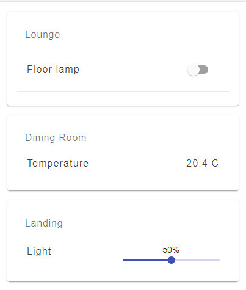

# George
A home automation UI for HomeSeer
## Install
1. Enter your keys in 'root/config/keys.js
2. Navigate to the root folder in your preferred command prompt
3. Run 'npm install' and 'npm run client-install'
4. Given that the database is located in the parent root folder, you should now be able to run the application with command 'npm run setup'

**Note: The browser must have Redux Dev Tools installed to work with this application.**
## Setup
Navigate to url/setup in your preferred browser.

## Home
Example of home view

