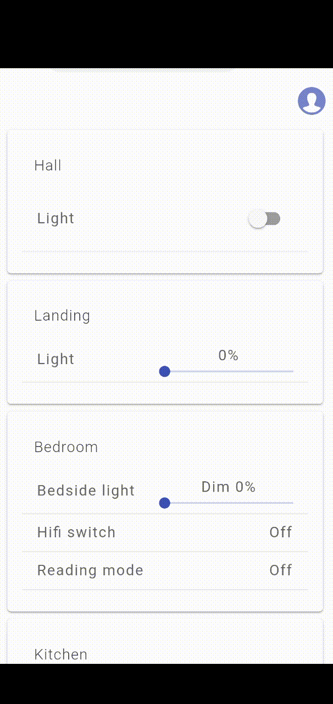
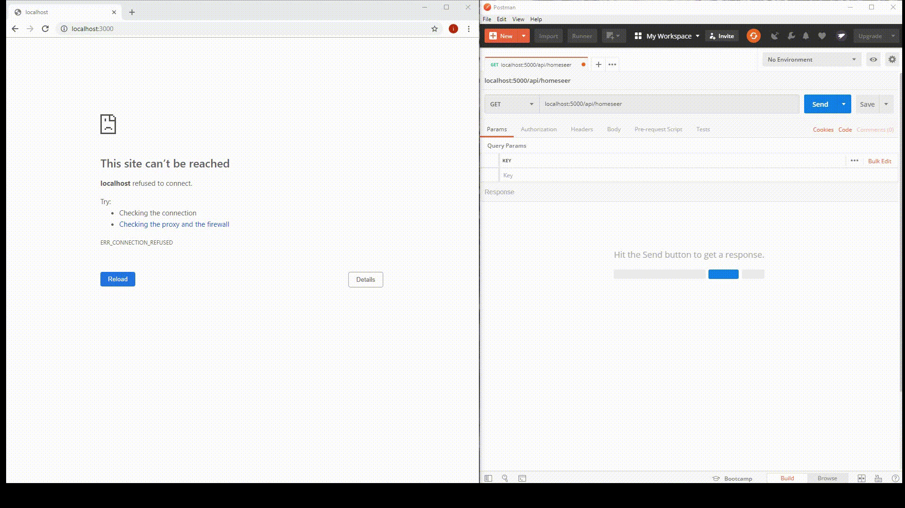
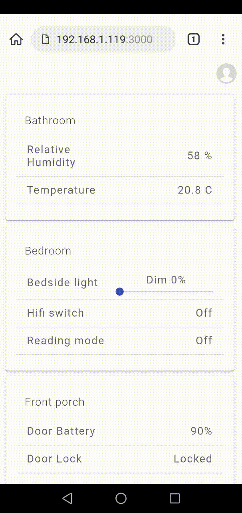
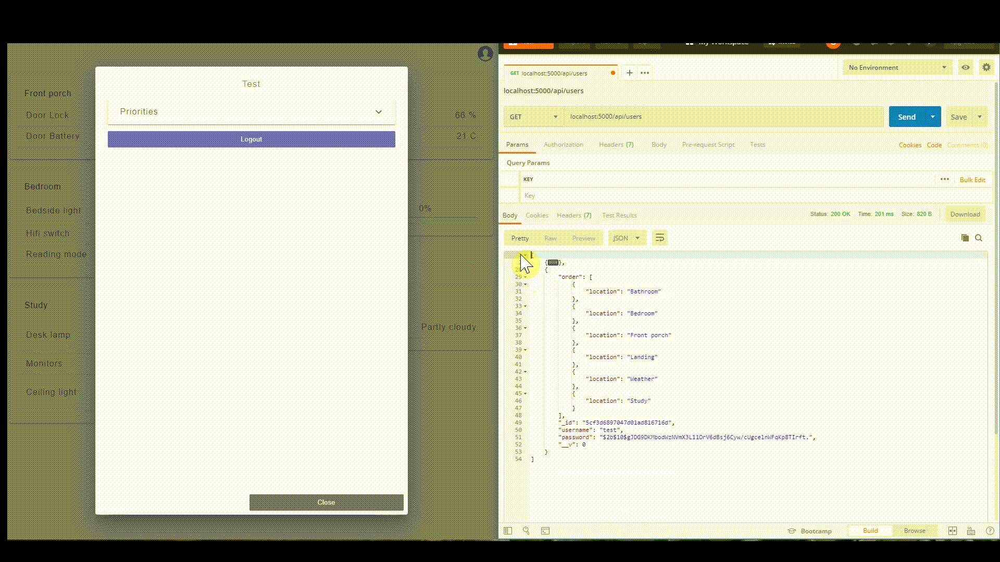
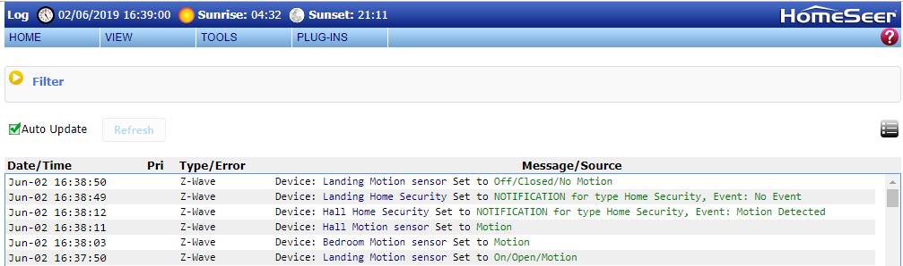

# Butler
*A digital butler that bridge the gap between humans and home automation*

Butler is a modular DIRT application developed in full-stack JavaScript. The application can be easily configured to different home setups, covering various technologies and layouts. It enables users to concurrently view and interact with the state of their specific home automation setup. By displaying content from sensors, automation devices and appliances it provides an intelligently sorted view of information, in context, from where users can interact with the house. George is comaptible with HomeSeer 3 automation system.



## Prerequisites
- Node.js
- MongoDB (running)
- HomeSeer 3 setup
- Motion detector connected to HomeSeer 3
- Kiwi browser for mobile clients
- Redux dev tools extension added in browser
- Download and extract George in desired location
- Insert your keys in 
## Install
### Run as Windows service
1. Follow the instructions of this link: https://tomasz.janczuk.org/2011/08/hosting-nodejs-applications-in-iis-on.html
### Run manually from command prompt
1. Inside George root folder, run 'npm install' and 'npm client-install'
2. Run 'npm start'
3. Navigate to url:port in a browser

**Note: The browser must have Redux Dev Tools installed to work with this application.**

## Results
### 1: Get devices from HomeSeer
#### Demo

#### Code
```
export const getHomeseerData = () => dispatch => {
    axios
        .get(keys.hsURI + keys.getStatus) // HomeSeer URI + HomeSeer API
        .then(res => {
            axios
                .post('/api/homeseer', {
                    devices: res.data.Devices
                })
                .then(res => {
                    dispatch(setHomeLoading()); // Displays loading animation
                    dispatch(getHomeseer()); // Sets HomeSeer devices in state
                })
                .then(() => {
                    dispatch(setView(2)); // Determines which component to render in the view
                })
                .catch(err => {
                    throw err;
                })
        })
        .catch(err => {
            throw err;
        });
}
```
### 2: Setup George
#### Demo


### 3: Login
#### Demo


### 4: Reorder locations
#### Demo


### 5: View state

#### Log: HomeSeer

#### Code
```
() => {
    const loggedIn = this.props.user.isLoggedIn;
    if(loggedIn) {
        this.props.getUserOrder(this.props.user.username);
    }
    let order = this.props.home.order;
    const array = []; // defaultView w/ updated values
    const orderObjects = []; //order by motion
    axios
        .get('/api/homeseer')
        .then(res => { // update the default view with new values derived from homeseer devices stored in the database
            const data = res.data[0].devices;
            const defaultView = this.props.home.defaultView;
            defaultView.map(item => {
                const obj = item;
                data
                    .filter(device => device.ref === obj.ref)
                    .map(device => {
                        obj.value = device.value;
                        obj.status = device.status;
                        array.push(obj);
                    });
            });
            return data;
        })
        .then(data => { // update the default view in the database with new values
            this.props.updateDefaultView(array);
            return data;
        })
        .then(data => { // find motion sensor for each location
            order.map(item => {
                data
                    .filter(device => device.location === item && device.name == 'Motion sensor')
                    .map(device => {
                        const motion = device.value > 0 ? true : false;
                        const lastChange = device.last_change.match(/\d+/g).map(Number);
                        const date = new Date(lastChange[0]);
                        const object = {location: device.location, motion: motion, lastChange: date};
                        orderObjects.push(object);
                    });
            });
        })
        .then(() => {
            orderObjects.sort(function(a, b) { // order locations by motion
                return a.lastChange - b.lastChange
            }).reverse().sort(function(x, y) {
                return (x.motion === y.motion)? 0 : x.motion? -1 : 1;
            });
            return orderObjects;
        })
        .then(res => { // insert locations without motion last in array
            const temp1 = [];
            const temp2 = [];
            const finalArray = [];
            const locs = this.locations(res);
            locs.map(item => {
                temp1.push(item);
            });
            if(locs.length !== order.length) {
                for(var i = 0; i < order.length; i++) {
                    if(!locs.includes(order[i])){
                        temp2.push(order[i]);
                    }
                }
            }
            temp2.map(item => {
                temp1.push(item);
            });
            return temp1;
        })
        .then(res => { // If user is logged in, order devices further IF they aren't already prioritised correctly
            const resp = res;
            if(this.props.user.isLoggedIn) {
                axios
                    .get('/api/users')
                    .then(res => {
                        const users = res.data;
                        users.filter(user => user.username === this.props.user.username)
                        .map(user => {
                            const userOrder = user.order;
                            const l = this.locations(orderObjects);
                            userOrder.filter(item => l.includes(item.location))
                            .map(item => {
                                const find = orderObjects.find(data => data.motion === true && data.location === item.location);
                                if(find) {
                                    const iMotion = resp.findIndex(i1 => i1 === item.location);
                                    const iOrder = userOrder.findIndex(i2 => i2.location === item.location);
                                    // if user index is lower than motion index, find index in resp then swap or move
                                    if(iOrder < iMotion) {
                                        let temp = resp.find(i3 => i3 === item.location);
                                        let tempOrder = userOrder.find(i2 => i2.location === item.location).location;
                                        let iO = resp.findIndex(i3 => i3 === item.location);
                                        resp[iMotion] = tempOrder;
                                        resp[iO] = temp;
                                    }
                                }
                            });
                        });
                    })
                    .catch(err => {
                        throw err;
                    });
                return resp;
            } else {
                return res;
            }
        })
        .then(res => { // Set new order in state
            this.props.setOrder(res);
        })
        .catch(err => {
            throw err;
        });
}
```
